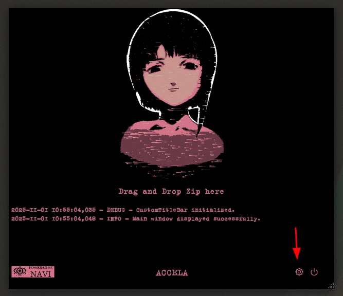
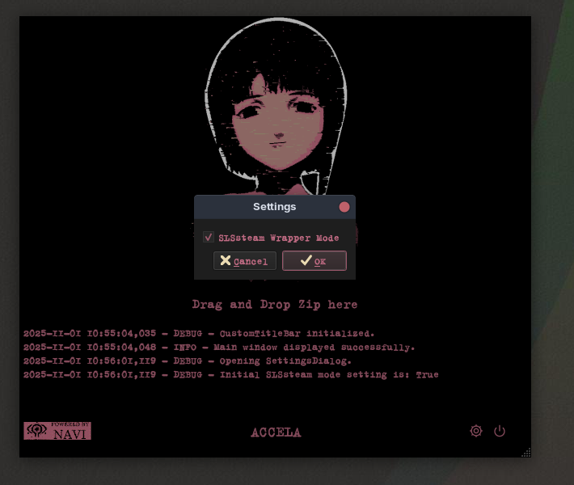
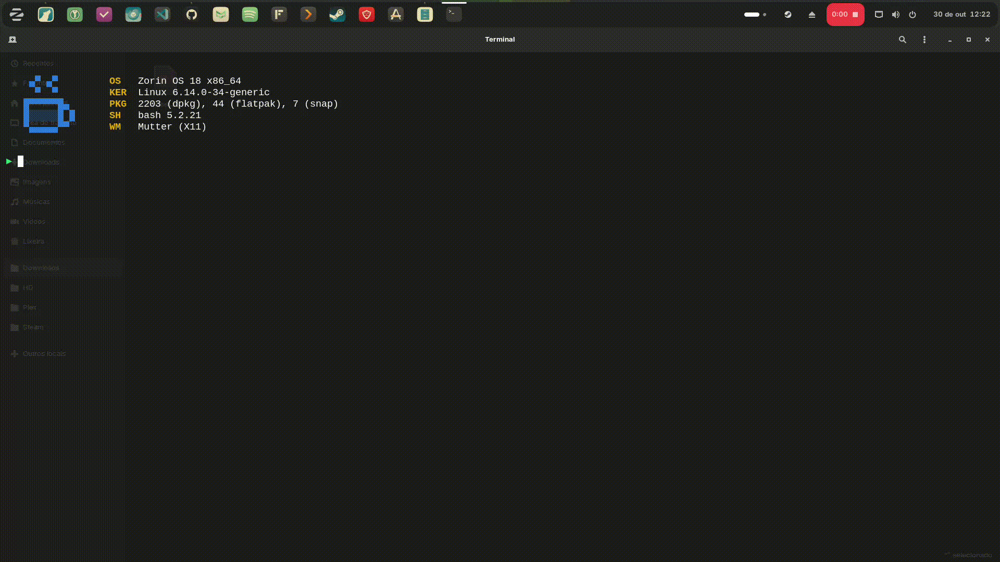

## 1. SLSsteam

**Fonte:** ([GitHub - AceSLS/SLSsteam](https://github.com/AceSLS/SLSsteam)), [Reddit - GUIA](https://www.reddit.com/r/SteamDeckPirates/comments/1leqim0/guide_slssteam_how_to_unlock_dlcs_bypass_family/?tl=pt-br)

## 2. ACCELA

**Fonte:** [Youtube - JD Ros](https://www.youtube.com/watch?v=jQUEtr200SU)

> [!WARNING]
> 
> Não encontrei o responsável direto por essa ferramenta. No entanto, ao analisar o arquivo `main.py` disponível, é possível observar que ela utiliza o projeto [SteamDepotDownloaderGUI](https://github.com/mmvanheusden/SteamDepotDownloaderGUI?tab=readme-ov-file) como base.

### Diferenças entre o instalador original e a versão modificada

| Aspecto              | Original           | Modificado                                           |
| -------------------- | ------------------ | ---------------------------------------------------- |
| Propósito            | Instala o ACCELA ✅ | Instala o ACCELA ✅                                   |
| Funcionalidade extra | Nenhuma ❌          | Verifica dependências e limpa instalações antigas. ✅ |

## 3. SLSah

**Fonte:** [GitHub - niwia/SLSah](https://github.com/niwia/SLSah) 

### Diferenças entre o instalador original e a versão modificada

| Aspecto              | Original          | Modificado                                                                   |
| -------------------- | ----------------- | ---------------------------------------------------------------------------- |
| Propósito            | Instala o SLSah ✅ | Instala o SLSah ✅                                                            |
| Funcionalidade extra | Nenhuma ❌         | Verifica dependências, detecta o terminal correto e cria atalho universal. ✅ |

## Instalação da trindade ┿

```bash
curl -sSL https://raw.githubusercontent.com/aglairdev/sls-trin/main/install.sh | bash
```

- [Tutorial em vídeo](https://www.youtube.com/watch?v=MH8kYaEtA6U)

## Config

### SLSsteam

`~/.config/SLSsteam/config.yaml`

PlayNotOwnedGames: yes

### Accela

<p align="center">
  
  
</p>

## Backup de saves/conquistas

```bash
cd ~/sls-trin
sudo chmod +x backup.sh
./backup.sh
```

## Desinstalação

```bash
cd ~/sls-trin
sudo chmod +x uninstall.sh
./uninstall.sh
```

## Demo


