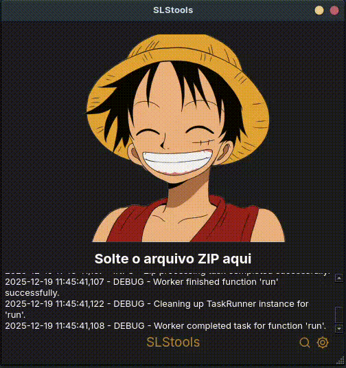
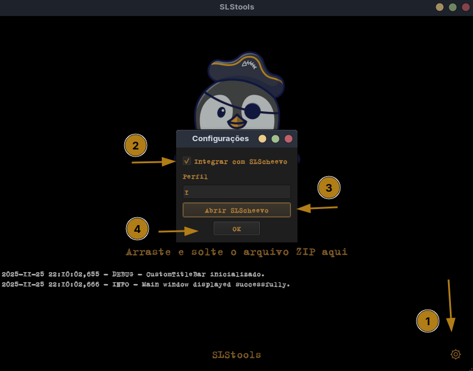
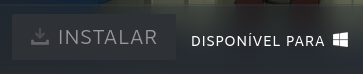
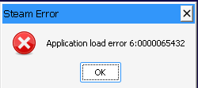

[](https://github.com/aglairdev/SLStools)

## Updates

- Integração com SLScheevo
- Modificação da interface do Accela para SLStools
- Tradução da interface para pt-br 🇧🇷

## Requisitos

- `curl`
- Steam nativa (não compatível com Flatpak ou Snap)

## Distros testadas

| Distro   | Status |
|----------|:-------: |
| Kubuntu  |   ✅     |
| Zorin    |   ✅     |

## Instalação

```bash
curl -sSL https://raw.githubusercontent.com/aglairdev/SLStools/conquistas/install.sh | bash
```

<p align="center">
  
</p>

## Config

### Depots

- [Ryuu](https://generator.ryuu.lol/)
- [Luatools](https://discord.com/invite/luatools)
> luatools — gen-games-here — [appid]

### SLStools

> [!WARNING]
> **Feche a Steam antes de iniciar a compra.**. O script abre a Steam para reconhecer o jogo pelo SLScheevo e, após gerar as conquistas, solicita a reinicialização da Steam. Se a Steam estiver aberta, o script pode não conseguir reconhecer o jogo corretamente e falhar na geração das conquistas.

### SLScheevo

Abra o SLScheevo pelo menos uma vez para adicionar as credenciais.

<p align="center">
  
</p>

### Driver recomendado (Nvidia)
- nvidia-driver-570

## Backup saves/conquistas

```bash
cd ~/SLStools/scripts/
sudo chmod +x backup.sh
./backup.sh
```

## Desinstalação

```bash
cd ~/SLStools/scripts
sudo chmod +x uninstall.sh
./uninstall.sh
```

## Fix

<p align="center">
  
</p>

`~/.config/SLSsteam/config.yaml` — PlayNotOwnedGames: yes

<p align="center">
  
</p>

Clique com o botão direito do mouse no jogo — Propriedades — Compatibilidade — Forçar uso de ferramenta de compatibilidade do Steam Play específica — Proton Experimental

<p align="center">
  
</p>

`~/SLStools/scripts/Steamless` — Descompacta o arquivo — Faz uma cópia do `.exe` do jogo e cola na raiz do Steamless — Executa o `Steamless.exe` com PortProton, seleciona o atalho e gera a versão sem DRM — Substitui essa versão no local do jogo e renomeia conforme necessário

> [!WARNING]
> Steamless remove DRM, SteamStub e variantes. Portanto, Denuvo, entre outros, não irão funcionar.

- [Tutorial em vídeo](https://www.youtube.com/watch?v=fOxr_FuCRdA)
- [PortProton](https://flathub.org/pt-BR/apps/ru.linux_gaming.PortProton)
- [Atalhos corrigidos](/scripts/Steamless/fix/)

### Jogos que dependem de launcher

Baixar o fix e substituir os arquivos do jogo

- [Tutorial em vídeo](https://www.youtube.com/watch?v=a2dd0BnXN4s)
- [Fixes - Ryuu](https://generator.ryuu.lol/fixes)

## Créditos

- [SLSsteam](https://github.com/AceSLS/SLSsteam)
- [DepotDownloaderMod](https://github.com/SteamAutoCracks/DepotDownloaderMod)
- [Conheci o Accela neste canal, mas seu real autor é desconhecido](https://www.youtube.com/watch?v=jQUEtr200SU)
- [SLScheevo](https://github.com/xamionex/SLScheevo)
- [SLSah](https://github.com/niwia/SLSah)
- [Steamless](https://github.com/atom0s/Steamless)
