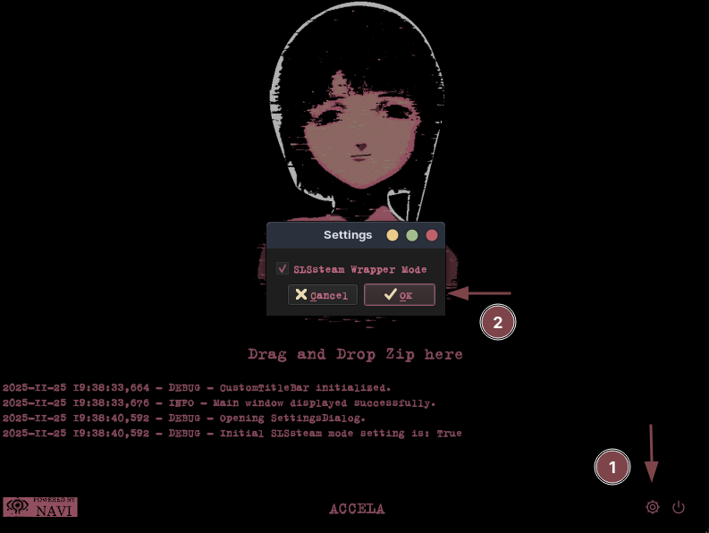

[](https://github.com/aglairdev/SLStools)

> [!WARNING]
> **Versão desatualizada do Accela**
> 
> A atual versão do Accela `2026.01.01-15_42_36` abrange personalização, instalação do SLSsteam, remoção eficaz de DRM através do Steamless, geração de conquistas com SLScheevo, remoção de jogos, adição de jogos via API Morrenus entre outros
>
> O instalador [enter-the-wired](https://github.com/ciscosweater/enter-the-wired) instala todas dependências necessárias para funcionamento e a última versão do Accela
>
> Recomendo as seguintes fontes para manter-se atualizado: [Ciskao - Youtube](https://www.youtube.com/@ciskao) | [Ciskao - Discord](https://discord.gg/J9UApb8q) e [JD ROS - Youtube](https://www.youtube.com/@JDRos)
>
> Fiz um [vídeo-tutorial](https://www.youtube.com/watch?v=JO1L282VJV0) usando `enter-the-wired`, [Millennium](https://github.com/SteamClientHomebrew/Millennium), [Cyberia](https://github.com/ciscosweater/cyberia) e `Morrenus-API`

## Atualizações

- O Accela foi otimizado com maior compatibilidade, instalação limpa e verificação automática de dependências
- O SLSah foi atualizado com verificação de dependências, detecção automática de terminal, atualização do repositório e atalho universal na área de trabalho
- Configuração padrão de `PlayNotOwnedGames: yes`

## Requisitos

- `curl`
- Steam nativa (**não** compatível com Flatpak ou Snap)

## Distros testadas

| Distro   | Status |
|----------|:-------: |
| Kubuntu  |   ✅     |
| Zorin    |   ✅     |
| Manjaro  |   ✅     |

## Instalação

```bash
curl -sSL https://raw.githubusercontent.com/aglairdev/SLStools/accela/install.sh | bash
```

## Config

### Depots

- [Ryuu](https://generator.ryuu.lol/)
- [Luatools](https://discord.com/invite/luatools)
> luatools — gen-games-here — [appid]

### Accela

Ative a opção `SLSsteam Wrapper Mode`

<p align="center">
  
</p>

### Conquistas

#### SLScheevo

```bash
cd ~/Accela/conquistas/SLScheevo
./run.sh
```
> A ferramenta solicita credenciais da Steam

#### SLSah

```bash
cd ~/Accela/conquistas/
./SLSah-M.sh
```

> A ferramenta solicita uma chave API e ID da Steam

### Driver recomendado (Nvidia)

- nvidia-driver-570

## Backup saves/conquistas

```bash
cd ~/Accela/scripts/
sudo chmod +x backup.sh
./backup.sh
```

## Desinstalação

```bash
cd ~/Accela/scripts
sudo chmod +x uninstall.sh
./uninstall.sh
```

## Fix

<p align="center">
  
</p>

`~/.config/SLSsteam/config.yaml` — PlayNotOwnedGames: yes

<p align="center">
  
</p>

Botão direito no jogo — Propriedades — Compatibilidade — Forçar uso de ferramenta de compatibilidade do Steam Play específica — Proton Experimental

<p align="center">
  
</p>

`~/SLStools/scripts/Steamless` — Descompacta o arquivo — Faz uma cópia do `.exe` do jogo e cola na raiz do Steamless — Executa o `Steamless.exe` com PortProton, seleciona o atalho e gera a versão sem DRM — Substitui essa versão no local do jogo e renomeia conforme necessário

> [!WARNING]
> Steamless remove DRM, SteamStub e variantes. Portanto, Denuvo, entre outros, não irão funcionar

- [Tutorial em vídeo](https://www.youtube.com/watch?v=fOxr_FuCRdA)
- [PortProton](https://flathub.org/pt-BR/apps/ru.linux_gaming.PortProton)
- [Atalhos corrigidos](https://github.com/aglairdev/SLStools/tree/fix)

### Jogos que dependem de launcher

Baixar o fix e substituir os arquivos do jogo

- [Fixes - Ryuu](https://generator.ryuu.lol/fixes)

## Créditos

- [SLSsteam](https://github.com/AceSLS/SLSsteam)
- [DepotDownloaderMod](https://github.com/SteamAutoCracks/DepotDownloaderMod)
- Accela: *Autores desconhecidos.* Fontes confiáveis: [Ciskao - Youtube](https://www.youtube.com/@ciskao) | [Ciskao - Discord](https://discord.gg/g5rzCecj) e [JD Ros - Youtube](https://www.youtube.com/@JDRos)
- [SLScheevo](https://github.com/xamionex/SLScheevo)
- [SLSah](https://github.com/niwia/SLSah)
- [Steamless](https://github.com/atom0s/Steamless)
