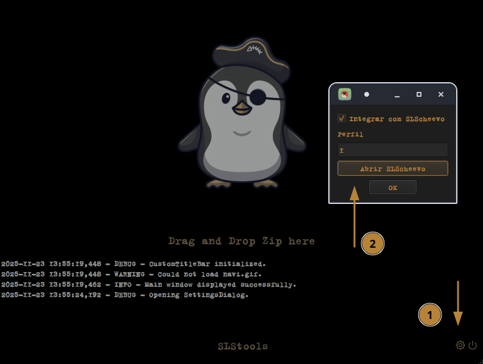

## Updates

Integração direta com SLScheevo e modificação da interface do Accela para SLStools.

## Instalação

```bash
curl -sSL https://raw.githubusercontent.com/aglairdev/SLStools/conquistas/install.sh | bash
```

## Config

### SLSscheevo

Abra o slscheevo pelo menos uma vez para adicionar as credenciais.

<p align="center">
  
</p>

### SLSsteam

Após comprar um jogo, um documento de configuração é gerado. Modifique um parâmetro neste arquivo.

`~/.config/SLSsteam/config.yaml`

PlayNotOwnedGames: yes